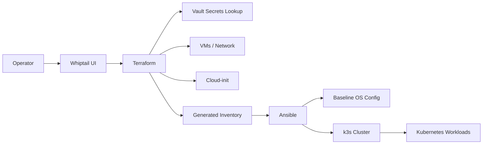
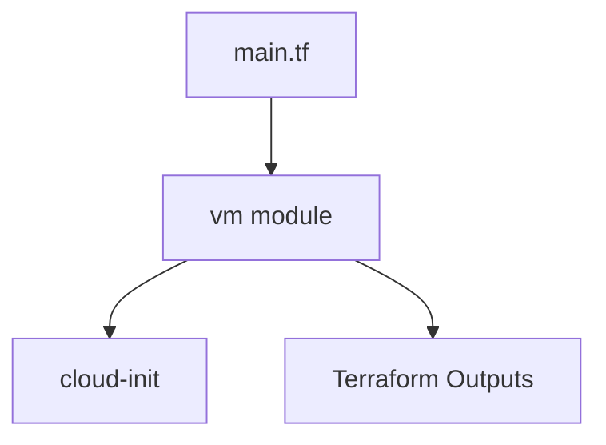
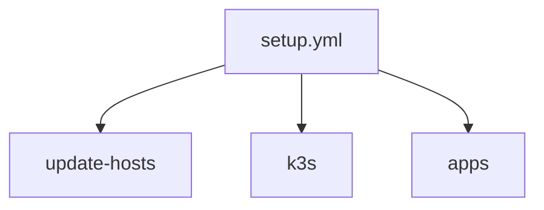
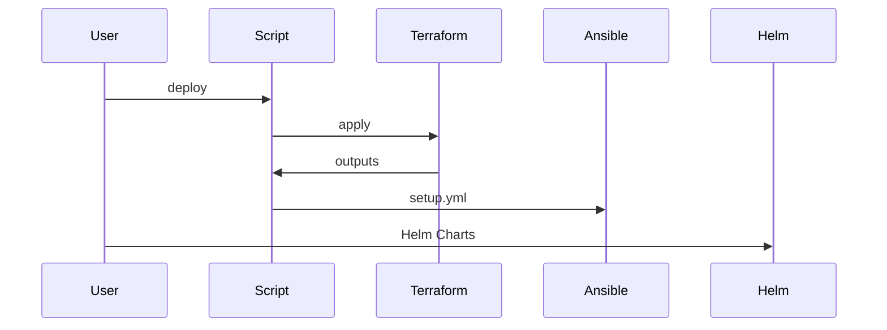

# 🏠 K3s Infrastructure

**Terraform + Ansible | Kubernetes-first Homelab**

This repository defines a **fully automated k3s-based homelab platform** built using Infrastructure as Code principles.

The stack provisions and configures a **lightweight Kubernetes cluster (k3s)** consisting of:

* **1 k3s server (control plane)**
* **2 k3s agent nodes (workers)**

Primary tooling:

* **Terraform** – VM & infrastructure provisioning
* **Cloud-init** – first-boot node initialization
* **Ansible** – OS configuration, k3s bootstrap, and application deployment
* **Shell scripts** – orchestration and lifecycle control
* **Whiptail** – Setup and Installation

The design emphasizes **reproducibility, modularity, and future expansion** while remaining small and understandable for homelab use.

---
## Setup Walkthrough

**Requirements** 
* **Hypervisor** - Proxmox
* **Controller** - OS with yum, dnf, or apt

---

## 📐 High-Level Architecture



---

## 🧩 Cluster Topology

| Node Name     | Role   | Description              |
| ------------- | ------ | ------------------------ |
| `k3s-master`  | Server | Kubernetes control plane |
| `k3s-node-01` | Agent  | Worker node              |
| `k3s-node-02` | Agent  | Worker node              |

The control plane is **non-HA by design** (homelab-appropriate), but the layout allows for future HA expansion if desired.

---

## 📁 Repository Structure

```
homelab/
├── README.md
├── terraform/
│   ├── main.tf
│   ├── variables.tf
│   ├── outputs.tf
│   ├── provider.tf
│   ├── inventory.tf
│   ├── locals.tf
│   ├── vault_secrets.tf
|   ├── secrets.tfvars.tf
│   ├── inventory.ini.tmpl
│   ├── modules/
│   │   └── vm/
│   │       ├── main.tf
│   │       ├── outputs.tf
│   │       ├── variables.tf
│   │       └── terraform.tf
│   └── cloud-init/
│       └── rocky-config.tpl
│
├── ansible/
│   ├── ansible.cfg
│   ├── inventories.ini
│   ├── roles/
│   └── playbooks/
│       ├── setup.yml
│       ├── reboot.yml
|       ├── upgrade.yml
│       └── reset.yml
│
├── scripts/ (so many)
│
└── .gitignore
```

---

## 🌍 Terraform – Infrastructure Provisioning

All infrastructure provisioning lives under `terraform/`.

### Responsibilities

* VM lifecycle management
* Network abstraction
* Cloud-init injection
* Exporting node metadata for Ansible
* Environment consistency (dev / prod ready)

Terraform is **cluster-aware**, provisioning nodes with roles that map directly to k3s server and agent responsibilities.

### Module Overview



### Inventory Generation

Terraform dynamically generates an Ansible inventory:

```
ansible/inventory.ini
```

This inventory acts as the **single source of truth** for node roles and IP addressing.

---

## ⚙️ Cloud-init

Cloud-init handles **first-boot initialization** for all nodes:

* SSH access
* Base system packages
* Hostname assignment
* Network configuration
* Initial user setup

📄 Located at:

```
terraform/cloud-init/rocky-config.tpl
```

Cloud-init keeps Ansible focused on **cluster logic**, not OS bootstrapping.

---

## 🔧 Ansible – Configuration & Cluster Management

Ansible manages **everything after the VM is reachable**.

### Responsibilities

* System updates & baseline configuration
* k3s server installation
* k3s agent join workflow
* Kubernetes application deployment

### Role Architecture



### Core Roles

| Role           | Description                                 |
| -------------- | ------------------------------------------- |
| `k3s_server` | Installs and configures k3s server             |
| `k3s_agent`  | Installs and configures agents |
| `raspberrypi` | Identifies if there are any Raspberry Pis as part of the cluster |
| `k3s_upgrade` | Upgrades the k3s cluster |
| `outside_cluster_tools` | Installs helm and kubectl to control the cluster from the controller node |


---

## 📦 Kubernetes Workloads

### Currently Deployed

* *nothing - See Future plan*

### Planned / Future Applications

These workloads are **planned**, but not yet fully implemented:

| Application                    | Purpose                                             |
| ------------------------------ | --------------------------------------------------- |
| **Ingress Controller**         | Centralized HTTP/HTTPS routing (NGINX)    |
| **Monitoring Stack**           | Metrics & visibility (TBD)         |
| **Internal Services Platform** | Self-hosted tools (dokuwiki, dashboards, keycloak) |

Each application will be deployed as **native Kubernetes manifests or Helm charts**, managed via Ansible.

---

## 🚀 Scripts & Automation

Scripts serve as the **operator control layer**.

### `deploy_infrastructure.sh`

End-to-end deployment:

1. Terraform init & apply
2. Inventory regeneration
3. k3s bootstrap via Ansible
4. Base workloads deployment



### `destroy_infrastructure.sh`

Safely destroys all Terraform-managed infrastructure.

---

## 📦 Prerequisites

* Terraform ≥ 1.x
* Ansible ≥ 2.14
* SSH access to all nodes
* Proxmox


---

## 🧠 Design Principles

* **Kubernetes-first architecture**
* **Infrastructure as Code**
* **Idempotent operations**
* **Composable roles & modules**
* **Homelab realism (simple > clever)**

---

## 🛣️ Roadmap

* Monitoring & alerting
* Homelab Services (wikijs, keycloak, etc.)

---

## ⚠️ Notes

* Designed for learning, iteration, and controlled complexity.
* K3s 1.31 is the current stable line. kubectl is at 1.35.1. Version skew tolerance is +/-1, but kubectl is backwards compatible and still working.